# PR16IMMK

## Video game sales with ratings

We have chosen a dataset from Kaggle, https://www.kaggle.com/rush4ratio/video-game-sales-with-ratings
**Goals**

**Data** 

The data set consists of video games, information on their sales and ratings received by Metacritic1 and ESRB2. The basic data and sales data are taken over by VG Chartz3 and are then complemented by ratings from Metacritic and ESRB. Only games that are sold in more than 100000 copies are included.

Attribute | Description      | Type | Value
----------|------------------|------|------
Name      | Name of the game | String | Discrete
Platform | Console on which the game is running | String | Discrete
Year_of_Release | Year of release | Numeric | Discrete
Genre | Genre |  String | Discrete
Publisher | Company that publishes the game | String | Discrete
NA_Sales | Game sales in North America in millions of units | Numeric | Continuous
EU_Sales | Game sales in Europe in millions of units | Numeric | Continuous
JP_Sales | Game sales in Japan in millions od units | Numeric | Continuous
Other_Sales | Game sales in the rest of the world, i.e. Africa, Asia excluding Japan, Australia, Europe excluding EU and South America in millions of units | Numeric | Continuous
Global_Sales | Total sales in the world in millions of units 4 | Numeric | Continuous
Critic_Score | Aggregate score compiled by Metacritic staff | Numeric | Continuous
Critic_Count | The number of critics used in coming up with the critic score | Numeric | Discrete
User_Score | Score by Metacritic's subscribers | Numeric | Continuous
User_Count | Number of users who gave the user score | Numeric | Discrete 
Developer | Party responsible for creating the game | String | Discrete
Rating | The ESRB ratings (e.g.Everyone, Teen, Adults Only..etc.) | String | Discrete

**Descriptive Sctatistics**

 X | Name | Platform | Year_of_Release | Genre | Publisher | Developer 
------------- | ------------- | ------------- | ------------- | ------------- | ------------- | ------------- 
count | 6825 | 6825 | 6825 | 6825 | 6825 | 6825
unique | 4377 | 17 | 25 | 12 | 262 | 1289 
mean | / | / | 2007.43 | / | / | / 
std | / | / | 4.21 | / | / | / 
min | / | / | 1985 | / | / | /
25% | / | / | 2004 | / | / | /
50% | / | / | 2007 | / | / | /
75% | / | / | 2011 | / | / | /
max | / | / | 2016 | / | / | /

X | NA_Sales | EU_Sales | JP_Sales | Other_Sales | Global_Sales 
------------- | ------------- | ------------- | ------------- | ------------- | ------------- 
count | 6825 | 6825 | 6825 | 6825 | 6825 
unique | 351 | 273 | 157 | 144 | 536  
mean | 0.394 | 0.236 | 0.064 | 0.082 | 0.777  
std | 0.967 | 0.687 | 0.287 | 0.269 | 1.963  
min | 0 | 0 | 0 | 0 | 0.01 
25% | 0 | 0| 0 | 0 | 0.11 
50% | 0.15 | 0.06 | 0 | 0.02 | 0.29
75% | 0.39 | 0.21 | 0.01 | 0.07 | 0.75 
max | 41.36 | 28.96 | 6.5 | 10.57 | 82.53 

X | Critic_Score | Critic_Count | User_Score | User_Count |Rating 
------------- | ------------- | ------------- | ------------- | ------------- | ------------- 
count | 6825 | 6825 | 6825 | 6825 | 6825 
unique | 81 | 106 | 89 | 875 | 7  
mean | 70.27 | 28.93 | / | 174.72 | /  
std | 13.86 | 19.22 | / | 587.42 | /  
min | 13 | 3 | / | 4 | / 
25% | 62 | 14 | / | 11 | / 
50% | 72 | 25 | / | 27 | / 
75% | 80 | 39 | / | 89 | / 
max | 98 | 113 | / | 10665 | / 

**Analysis**

Pre-processing the Data

Before we make a pre-processing, the set has 16719 samples. Once the samples are removed that have no values for some attributes (most often because Metacritic does not cover all platforms), there are approximately 6900 items. From these, we are discarding games for which we do not have a year of release, and finally, 6825 instances remain with all the attributes. We think that these are enough instances to work with. However, because of this we lose a large part of the games before 1999 (before Metacritic is formed), a small part of these games have all the attributes. Additionally, as seen in the graph for the year of production there are several years after the formation of Metacritic for which we do not have data at all. For these reasons, we kept the original set in case we need the data in the future work.

Year of Release

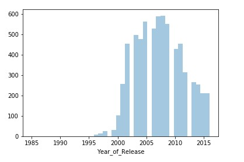

The holes in the histogram for the Year_of_Release indicates that for specific years we have no data due to the pre-processing process. An interesting trend is the increase in the number of produced games per year until 2009, after which this number begins to decrease. An interesting hypothesis that could be the subject of further research is that this trend is due to the economic crisis in 2009. The histogram shows that the data is negatively skewed. Additionally, we have a small number of outliers and a small number of games before 1999 because Metacritic was formed in 1999.

**Sales**

The following five graphs refer to the attributes for total sales and sales in different regions of the world. Each of these graphs consists of three parts: histogram, box plot with outliers and box plot without outliers. In histograms and box plots with outliers we have a logarithmic scale in the y-axis, for a better view of the data. Box plot schedules without outliers have a linear scale on the y-axis and we have drawn them for a better overview of central tendency measures because some outliers deviate considerably from central tension measures and make the graph so vast. We can see that all data is positively skewed. This means that a small number of games are sold in huge quantities, while most games have significantly less sales. In general, the number of outliers is high, especially in Japan and countries that fall into Other_Sales. Another thing that can be noticed is that sales are the highest in North America. Next comes the European Union and Japan, and all other countries together have the smallest sales.

Global Sales

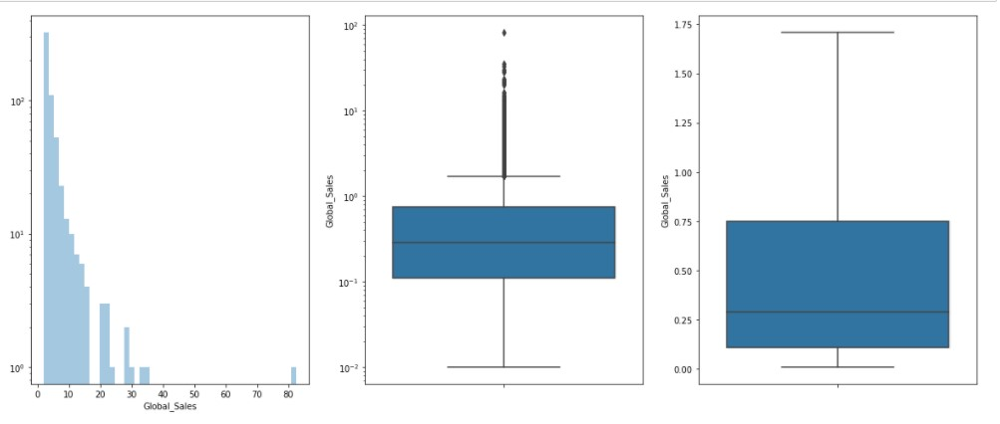

North America

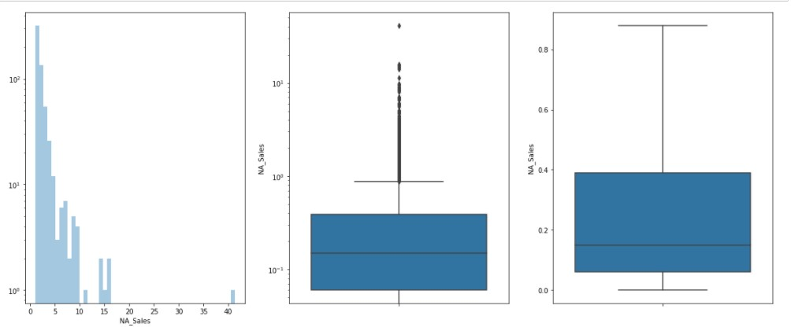

European Union

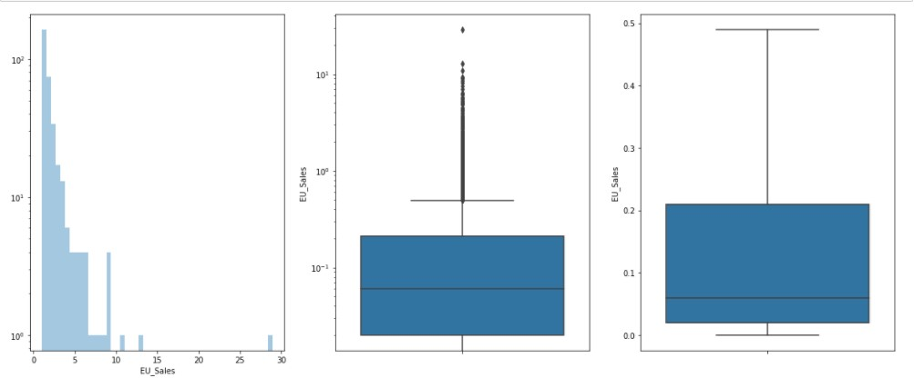

Japan

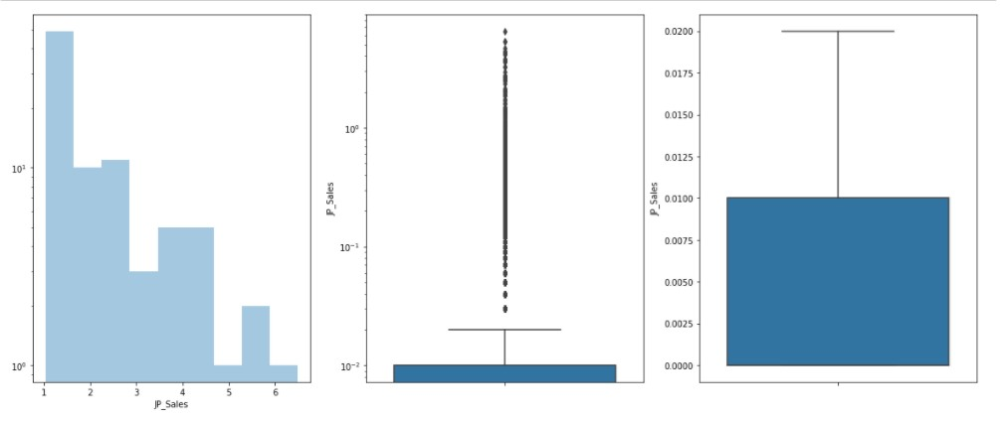

Other Sales

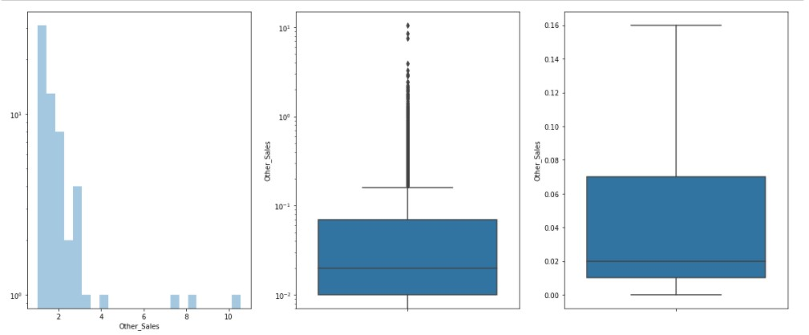

**Games Evaluation**

If we compare Critic_Score and User_Score, we can observe that the User_Score histogram is more negatively skewed than Critic_Score. This would mean that User_Score's mode is better centered than Critic_Score's, because subscribers tend to give higher scores, as expected, given the fact that critics are more objective in the assessment. We can also note that analysts and users, in general, give medium or high marks, which is a positive sign for the video game industry.
The User_Count histogram is much more positively skewed than the one for Critic_Count. 

Critic Score

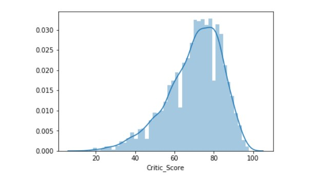

Critic Count

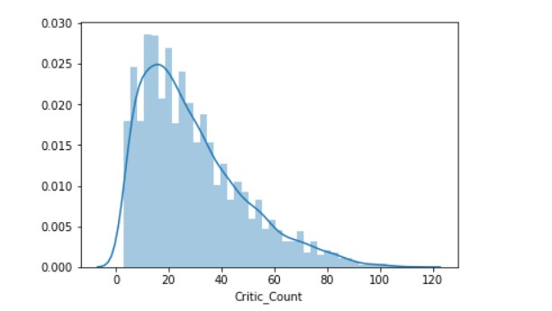

User Score 

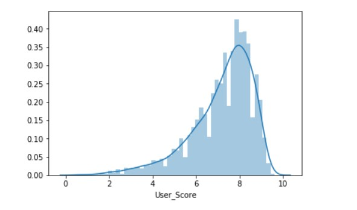

User Count

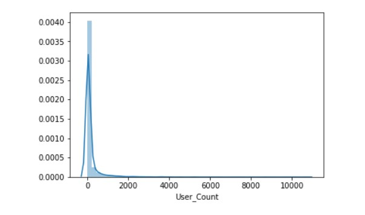

**Categorical Variables**

Platform
As we see from the video game Plarform bar plot, the most popular platforms are PS2, X360, PS3 and PC. This means that more games are produced for consoles, than for computers, probably because there are many games that are exclusive to a particular console.

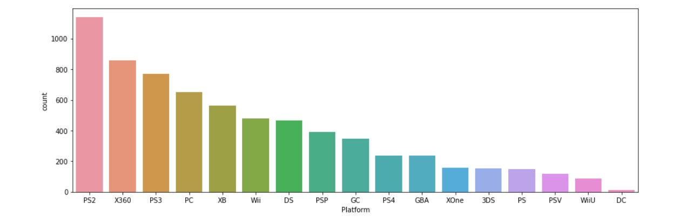

Genre
This bar plot is about the type of video games. It can be noticed that the most produced types are action games. With almost double production, sports and shooter games are followed.

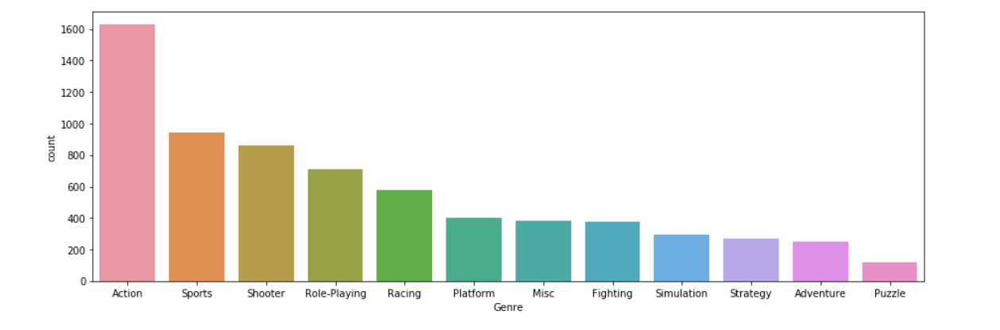

Developer
The first graph shows all game producers. Although we can not see the individual producers, we have drawn it to see the global trend that most of the games are made by small number of manufacturers, while a big number of manufacturers have made less than 10 games. This is consistent with the fact that there are several companies that produce a few games per year. On the other hand, there are a number of small independent companies that will produce several games before they are bought from a larger company or stop working. The second chart shows the 40 most-released manufacturers. It's interesting to note that even four studios of Electronic Arts (EA) and 2 Ubisoft studios are in the top 15 manufacturers.

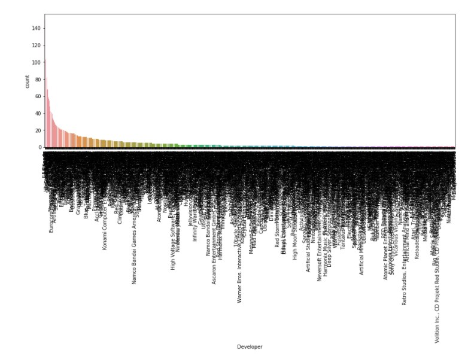
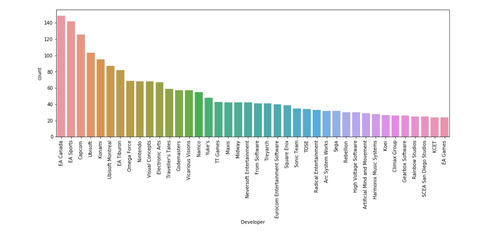

Publisher 

Again, the first chart shows all the publishers of games to see the global trend. We see that a small number of publishers are releasing a large number of games, while many of the publishing companies have less than 15 games released. This is caused by the same reasons as the trend in the producers of games. The second chart shows the 40 companies with the most issued games. It can be noted that most games have been released by Electronic Arts, which is expected given the fact that we saw on the manufacturers' charts that 4 of their studios are in the first 15 by number of produced games. The second company by the number of games released Ubisoft also has 2 studios in the first 15 by number of manufactured games. Additionally, other companies such as Nintendo, Capcom, etc. are among the top positions on both charts.

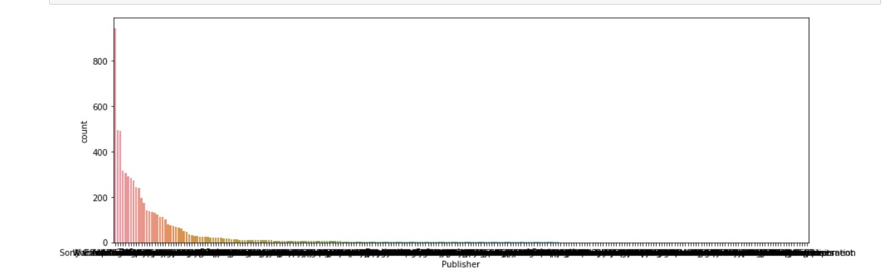
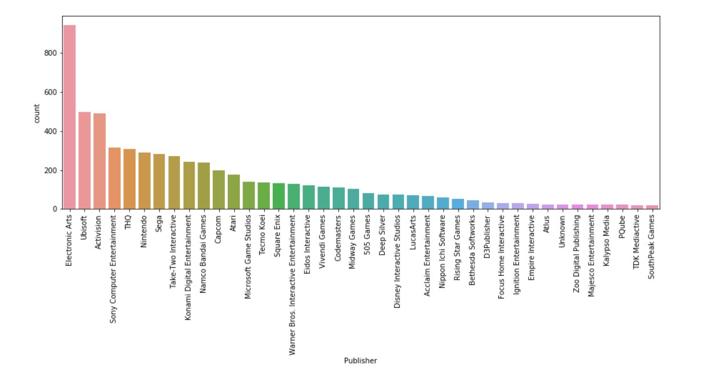

Rating

Overview of ESRB categories:
* EC (Early Childhood) rating is for content intended for the youngest children.
* E (Everyone) ratings are assigned to games that are generally appropriate for each age. It is possible to have a minimal display of violence or rare use of a dishonest vocabulary, but mainly based on fantasy.
* E10 + (Everyone 10+) ratings are for games intended for people over 10 years old. It is possible to have a minimal display of violence, the use of an objectionable dictionary and suggestive scenes, but mainly based on fantasy.
* T (Teen) ratings receive video games that are appropriate for people over 13 years old, can contain violence, blood, vulgar humor, and a brazen dictionary. Also, simulated gambling is common.
* M (Mature) rating is awarded to video games recommended for people over 17 years old. Games of this type contain intense violence, blood and sexual scenes and the strong use of vulgar vocabulary.
* AO (Adults Only) rating is for games suitable for people over 18 years old. They can contain longer scenes of intense violence and sexual content, and include gambling with real money.
* RP (Rating Pending) rating is a temporary rating received by new games that have not yet been evaluated by the ESRB. Once the game is evaluated by critics, this rating is replaced by the actual one.

Note: on the graphs we see another category: Kids to Adults. K-A ratings existed until January 1, 1998 and then renamed to Everyone. The category still exists because probably some older games that got their rating before 1998 have not changed.

From the chart of ESRB ratings we see that most of the games are in the categories T, E and M. It is noticeable that all games available on the market, more or less, are intended for any age, with certain restrictions on children and teenagers. These ratings are important because, according to recent research, 84% of parents are familiar with this rating system, and 69% regularly check the ESRB ratings before buying their child's game. Therefore, publishers wishing to expand in the children's and teenage world should be aware of certain conditions set by the ESRB. On the other hand, rating M is quite popular because there are a large number of adult people playing games. We see that the adult market is quite popular and in any case publishers are trying to keep the high percentage they have in this area.

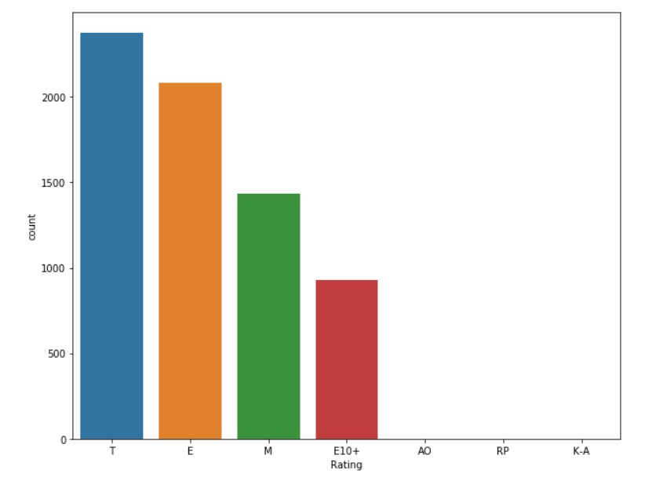
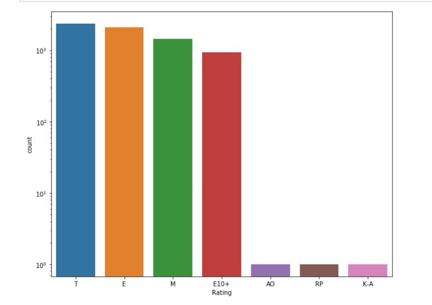

1Metacritic is a web site that collects reviews about a variety of music albums, video games, movies, series, etc. Finally, for each product, two average scores are calculated, one of the analysts in Metacritic, another from the subcribers on the site.

2ESRB(Entertainment Software Rating Board) is a non-profit organisation that assigns video games ratings and content based applications, the interctive elements it contains and the age for which it is intended.

3VG Chartz is a video game website that deals with data collections for video games, consoles and hardware.

4The attribute represents the sum of NA_Sales, EU_Sales, JP_Sales and Other_Sales. It can be removed for futher analysis or used as a summary attribute.
